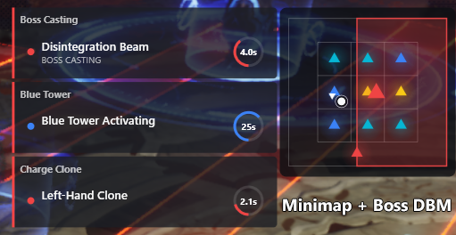
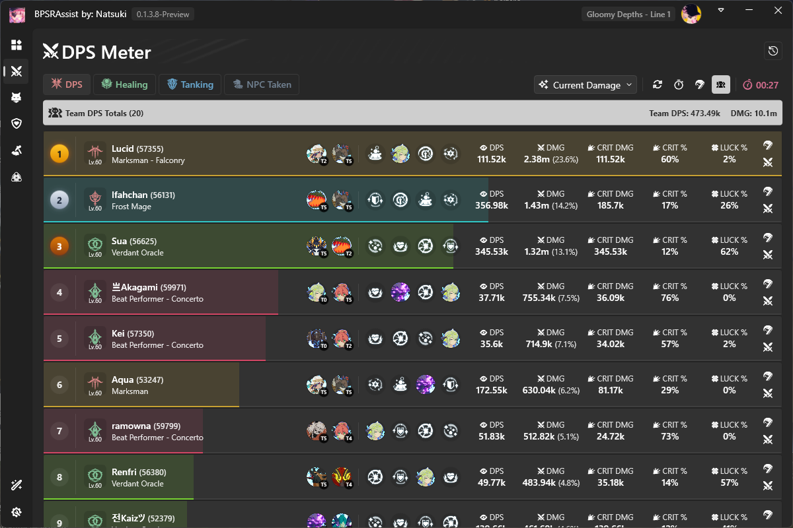
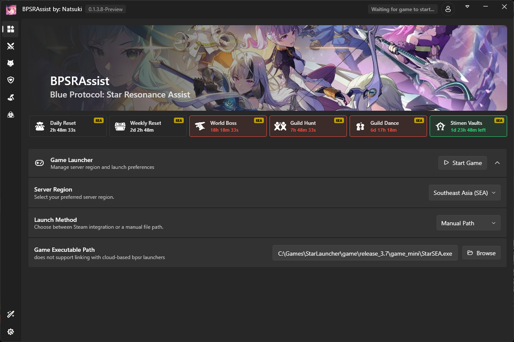

# BPSRAssist

> **Blue Protocol: Star Resonance Assist** — เครื่องมือช่วยเหลือ Overlay ฟรี สำหรับ Blue Protocol: Star Resonance

**[Thai](./README.md) | [English](./README.en.md)**

---

## 📖 ภาพรวม (Overview)

BPSRAssist คือเครื่องมือ Overlay บนเดสก์ท็อปน้ำหนักเบาสำหรับ **Blue Protocol: Star Resonance** — แสดงภาพกลไกดันเจี้ยนแบบเรียลไทม์ ช่วยทำงานอัตโนมัติ และเก็บสถิติการต่อสู้โดยละเอียด ทั้งหมดเรนเดอร์เป็น widget โปร่งใสซ้อนทับอยู่บนหน้าต่างเกม

**ใช้งานฟรี ไม่ต้องสมัครบัญชี**

---

## 📚 คู่มือการใช้งาน

- [คู่มือการใช้งาน Game Overlay](docs/OVERLAY_GUIDE.md)
---

## ✨ ฟีเจอร์

### 🗺️ Minimap Overlay
- **แสดงกลไกดันเจี้ยนแบบเรียลไทม์** — เรนเดอร์วงแหวน, sector, สี่เหลี่ยม, เส้น และรูปหลายเหลี่ยม บน minimap canvas ที่ปรับแต่งเองได้
- **ดันเจี้ยนที่รองรับ:**
  - **S3 Raid** — Phase buffs, การแมป phase, preset return, callouts, pinball, ลำดับวงแหวนแม่เหล็กไฟฟ้า
  - **S3 Sea Ringed Reef** — ลำแสง Matrix callout, โซนปลอดภัยน้ำแข็ง/คลื่น, โซนอันตรายรูปพิซซ่า, กลไกสีแบบ duet
  - **S3 Cursed Tomb** — กลไกแบบสี่เหลี่ยม (rectangle)
  - **S3 Giant Tower** — กลไกแบบสี่เหลี่ยม (rectangle)
  - **S3 Tina's Mindrealm** — กลไกแบบ sector
- **การแสดงผล entity** — ผู้เล่น (จุด + ลูกศรทิศทาง), เพื่อนร่วมทีม (จุด), บอส/มอนสเตอร์ (สามเหลี่ยม), เพื่อนร่วมทีมที่ตาย (แดงจาง)
- **ปรับสีและขนาด entity ได้** — ตั้งค่าตามประเภทผ่าน color picker และแถบเลื่อน
- **Layout overlays** — เส้นกริดสนาม, วงกลม, สี่เหลี่ยม, เส้นรัศมี ตามแต่ละดันเจี้ยน

### ⚔️ Auto Combat (ต่อสู้อัตโนมัติ)
- ต่อสู้อัตโนมัติ พร้อมตั้งค่า **ตำแหน่งล็อก (lock position)** และ **รัศมีจำกัด (radius limit)**
- **วงแหวนบน Minimap** (สีฟ้า) แสดงโซนต่อสู้
- สถิติแบบเรียลไทม์: จำนวนมอนสเตอร์ที่ฆ่า, เป้าหมายปัจจุบัน, ตำแหน่งบ้าน

### ⛏️ Auto Gathering (เก็บทรัพยากรอัตโนมัติ)
- เก็บทรัพยากรอัตโนมัติ พร้อม **lock position** และ **radius limit**
- **วงแหวนบน Minimap** (สีเขียว) แสดงรัศมีเก็บของ
- โหมดพรีวิว: แสดงวงแหวนก่อนเริ่มใช้งาน

### 🎣 Auto Fishing (ตกปลาอัตโนมัติ)
- ตกปลาอัตโนมัติ พร้อมสถิติติด/หลุด/คันเบ็ดหัก (catch / loss / rod-break)

### 📊 Overlay Widgets
| Widget | รายละเอียด |
|--------|-------------|
| **Minimap** | มินิแมปดันเจี้ยนพร้อมโซนกลไก |
| **Game Tasks** | การ์ดเลือกงาน (ตกปลา / เก็บของ / ต่อสู้) |
| **DPS Meter** | สถิติ DPS แบบเรียลไทม์ |
| **Buff Tracker** | ติดตามข้อมูลบัฟ/เดบัฟที่กำหนดไว้ |
| **Buff Monitor** | ติดตามบัฟที่กำลังมีอยู่ |
| **Debuff Monitor** | ติดตามเดบัฟที่กำลังมีอยู่ |
| **Boss DBM** | ตัวจับเวลากลไกบอส |
| **Stats Monitor** | ติดตามค่าสถานะตัวละคร |
| **Skill Log** | ประวัติการใช้สกิล |
| **Spawn Tracker** | ติดตามการเกิดของมอนสเตอร์ |
| **Clock** | แสดงเวลาในเกม |
| **Performance** | FPS และค่าสถิติระบบ |
| **Notification** | ระบบแจ้งเตือนในแอป |

### 📈 หน้า Analysis (การวิเคราะห์)
- **DPS Statistics** — วิเคราะห์ความเสียหายแบบละเอียดต่อเอนเคาน์เตอร์
- **Skill Breakdown** — สถิติความเสียหายและการใช้งานแยกตามสกิล
- **Buff Tracker** — ติดตามข้อมูลบัฟ/เดบัฟที่กำหนดไว้
- **Spawn Tracker** — ติดตามการเกิดของมอนสเตอร์
- **Module Optimizer** — ระบบแนะนำโมดูล

### 🔧 ฟีเจอร์เสริม (Features)
- **Game Launcher** — เปิด/ปิดเกมผ่าน Steam หรือระบุ path เอง (ภูมิภาค NA และ SEA)
- **ระบบคีย์ลัด (Hotkey)** — ปรับแต่งคีย์ลัดได้
- **อัปเดตอัตโนมัติ** — ระบบตรวจสอบอัปเดตในตัว

---

## 🚀 เริ่มต้นใช้งาน (Getting Started)

### ความต้องการของระบบ
- Windows 10/11 (x64)
- ติดตั้ง Blue Protocol: Star Resonance แล้ว

### การติดตั้ง
1. ดาวน์โหลด release ล่าสุด
2. แตกไฟล์ไปยังโฟลเดอร์ที่ต้องการ
3. รัน `BPSRAssist.exe`
4. ตั้งค่าภูมิภาคเซิร์ฟเวอร์ (NA / SEA) และวิธีการเปิดเกม (Steam / ระบุ path เอง)
5. กด **Start Game** หรือเปิดเกมแยกต่างหาก

---

## ⚙️ หลักการทำงาน (How It Works)

BPSRAssist จับข้อมูลเกมแบบเรียลไทม์และเรนเดอร์ข้อมูล Overlay ซ้อนทับบนหน้าต่างเกม Minimap จะอ่านสถานะดันเจี้ยน ตำแหน่ง entity บัฟ และสกิลที่ใช้ เพื่อแสดงโซนกลไกและคำเตือน — ช่วยให้คุณและทีมรับมือกลไกบอสได้อย่างมีประสิทธิภาพมากขึ้น

การตั้งค่าทั้งหมดถูกจัดเก็บในเครื่องผ่าน `config.yaml` (อยู่ข้างไฟล์โปรแกรม) ไม่มีการส่งข้อมูลไปยังเซิร์ฟเวอร์ภายนอก

---

## ⚠️ ข้อปฏิเสธความรับผิดชอบ (Disclaimer)

- เครื่องมือนี้ให้ใช้งาน **ตามสภาพ (as-is)** เพื่อการศึกษาและการใช้งานส่วนตัว
- โปรดใช้วิจารณญาณ และตรวจสอบข้อกำหนดการใช้งาน (Terms of Service) ของเกมเสมอ
- ผู้พัฒนาไม่รับผิดชอบต่อผลกระทบใดๆ ที่เกิดจากการใช้เครื่องมือนี้

---

## 📄 สิทธิ์การใช้งาน (License)

Copyright © Natsuki สงวนลิขสิทธิ์

ซอฟต์แวร์นี้ให้ใช้งานฟรีสำหรับการใช้งานส่วนตัว ห้ามเผยแพร่ ดัดแปลง หรือใช้ในเชิงพาณิชย์โดยไม่ได้รับอนุญาตเป็นลายลักษณ์อักษร
