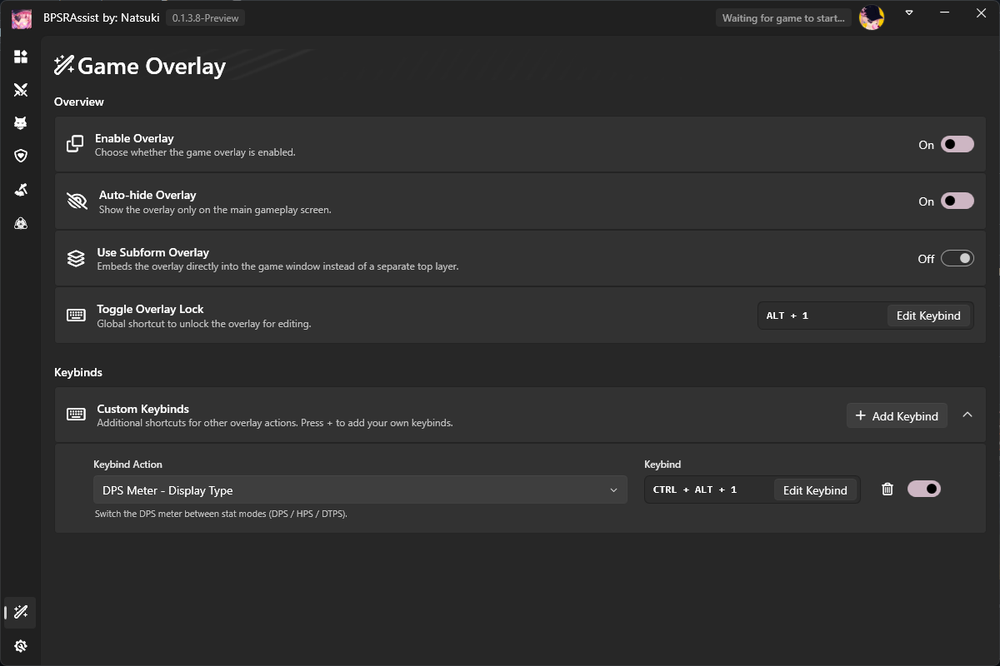
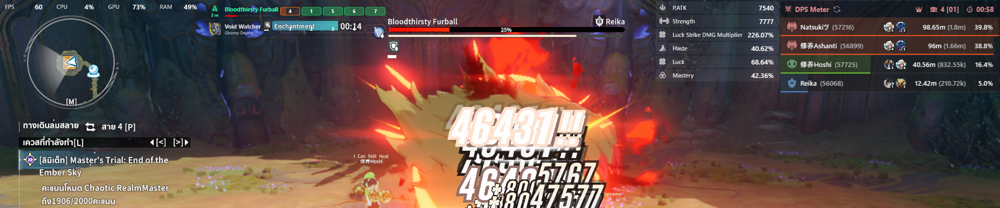
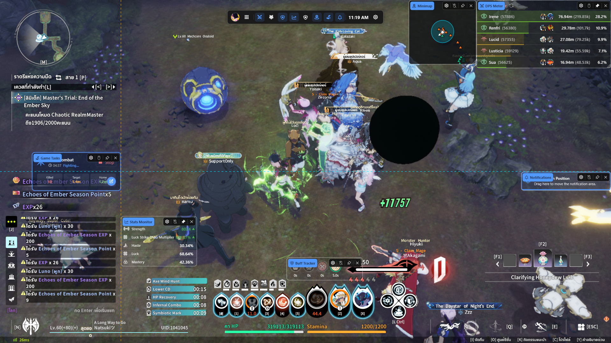
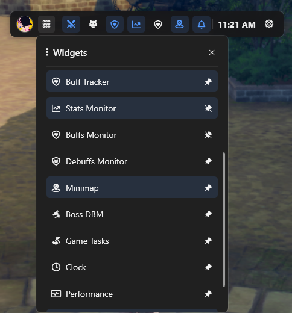
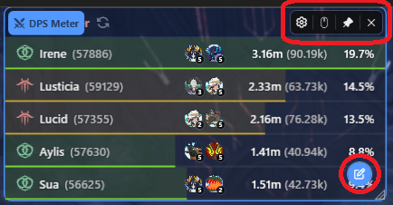
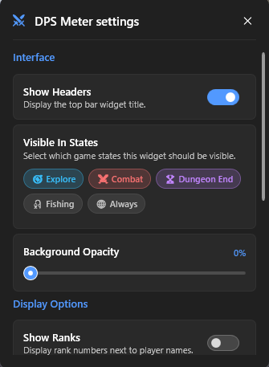
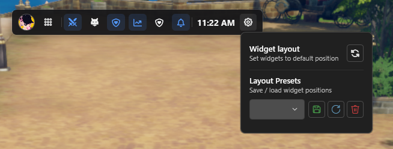
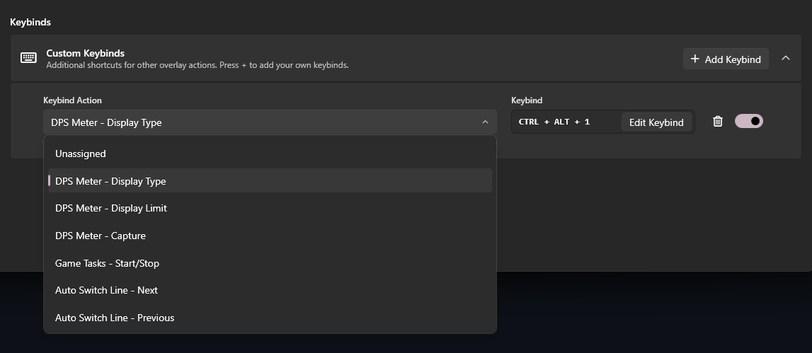

# BPSRAssist — Game Overlay User Guide

> 🌐 Language: [ไทย](OVERLAY_GUIDE.md) | [English](OVERLAY_GUIDE.en.md)

**Game Overlay** is a transparent window that BPSRAssist draws on top of the game window to show helpful information — DPS Meter, Minimap, buff/debuff status, spawn timers and more — without ever leaving the game.

> Note: hotkeys, options and screens in this guide reflect the current build. Values marked as **default** are shown in parentheses.

---

## Table of contents

1. [Enabling the Overlay](#1-enabling-the-overlay)
2. [Edit Mode — unlocking the layout](#2-edit-mode--unlocking-the-layout)
3. [Managing individual widgets](#3-managing-individual-widgets)
4. [The Control Bar and layout presets](#4-the-control-bar-and-layout-presets)
5. [Clicking / interacting with widgets while playing](#5-clicking--interacting-with-widgets-while-playing)
6. [Custom keybinds](#6-custom-keybinds)
7. [List of all widgets](#7-list-of-all-widgets)
8. [Extra notes](#8-extra-notes)

---

## 1. Enabling the Overlay

1. Open the **Game Overlay** page inside the app and turn on **Enable Overlay** *(default: On)*.
2. Launch the game through the app's launcher (or wait for the app to attach to the game window) — the overlay is created automatically while the game is running.
3. The overlay only shows while **the game window is the focused/foreground window**. If you switch to another window or the desktop, the overlay hides itself.

Main options on this page:

| Option | Default | Meaning |
|---|---|---|
| **Enable Overlay** | On | Master switch for the overlay |
| **Auto-hide Overlay** | On | Automatically hides the overlay when you are not on the main gameplay screen (e.g. during loading screens or in game menus/UI where the system cursor is visible). It stays visible during Dungeon End / Fishing and while holding `Alt` |
| **Use Subform Overlay** | Off | Embeds the overlay directly into the game window as a child window instead of a separate top layer |

---

## 2. Edit Mode — unlocking the layout

While playing normally the overlay is "locked" so you don't click it by accident. To move/resize widgets, unlock it first:

1. Press the **`ALT + 1`** hotkey *(default — change it on the Toggle Overlay Lock card of the Game Overlay page)*.
2. A **Control Bar** appears at the top-center of the screen and every widget gets a frame with action buttons (you are now in edit mode).

**Leaving edit mode** (any of the three — positions are saved automatically):

- Press the `ALT + 1` hotkey again
- **Click on empty space** on screen (not on a widget)
- Switch to another window for ~2 seconds (auto-exits edit mode)

**Arranging widgets in edit mode:**

- **Drag** any widget anywhere. Snap guides help you align:
  - Screen edges / center → cyan guide lines
  - Aligned with other widgets → orange guide lines
  - Grid snapping (Grid Snap)
- **Resize** by dragging any of the 8 corner/edge handles
- Positions/sizes are **saved as soon as you release the mouse**, and again when you leave edit mode

---

## 3. Managing individual widgets

### 3.1 Widget menu (enabling/disabling every widget)

Click the **☰ (Widget Menu)** button on the Control Bar to see the full list of widgets. Toggle each one on/off by clicking it, and press the pin 📌 icon to keep its shortcut pinned to the bar.

### 3.2 Per-widget action buttons (visible in edit mode)

While hovering a widget / in edit mode you get buttons on the widget frame:

- **⚙️ Settings** — opens that widget's settings panel (see 3.3)
- **Click-through** — toggles whether the mouse passes *through* this widget to the game (ideal for display-only widgets such as the Minimap)
- **📌 Pin** — pins/unpins this widget's shortcut on the Control Bar
- **✕ Close** — disables the widget
- **Pencil button (FAB)** at the bottom-right corner — opens the quick **Manage** menu of the widget (e.g. DPS Meter: switch DPS / Healing / Tanking mode and row count). Only widgets that have such a menu show it, and only while hovered

### 3.3 The settings panel (⚙️) of each widget

Every widget shares the same general section:

- **Show Headers** — whether the title bar on top of the widget is displayed
- **Visible In States** — choose the game states where this widget appears (🧭 Explore / ⚔️ Combat / 🏆 Dungeon End / 🎣 Fishing / 🌐 Always)
- **Background Opacity** — opacity of the widget background

Below that is the **widget-specific section**, e.g.:

- DPS Meter: Show Ranks, Show Class Icons, Show Imagines, Training Duration (dummy timer), Dummy target…
- Minimap: size/color of player-teammate-boss dots, Lock Direction, circle mode…

---

## 4. The Control Bar and layout presets

The Control Bar (only visible in edit mode) contains, from left to right:

1. **Character avatar**
2. **☰ button** — opens the Widget menu (3.1)
3. **Per-widget icon buttons** — quick on/off for each widget (lit = enabled; pinned 📌 widgets stay visible even when disabled)
4. **Clock**
5. **⚙️ button (Overlay settings)**:
   - **Widget layout → Reset** — resets every widget to its default position (reset icon button)
   - **Layout Presets** — save / load / delete full layouts (type a name in the box, then Save = green / Load = blue / Delete = red). Great for switching between setups, e.g. a farming layout vs. a boss layout

---

## 5. Clicking / interacting with widgets while playing

- Most widgets (Minimap, Buffs/Debuffs Monitor, Stats Monitor, Notifications…) are set to **Click-through**, so the mouse passes through them to the game and never interferes.
- Widgets with click-through **off** (e.g. DPS Meter, Skill Log, Spawn Tracker, Clock, Game Tasks) can be clicked/used by **holding `Alt` and hovering** over the widget (e.g. press the reset button in the DPS Meter header). Releasing `Alt` makes the mouse pass through again.

> Tip: if a widget feels like it is "blocking" your mouse, enable Click-through on it (edit mode → mouse icon button). If you want to click it without holding Alt, simply leave Click-through off.

---

## 6. Custom keybinds

On **Game Overlay → Keybinds**, press **Add Keybind**, pick a **Keybind Action** and press **Record Keybind** to capture your key combination (while recording, the box pulses red and shows `RECORDING...`).

Available actions:

| Action | Description |
|---|---|
| **DPS Meter - Display Type** | Switch the meter between DPS / HPS / DTPS *(default: `CTRL + ALT + 1`)* |
| **DPS Meter - Display Limit** | Cycle the number of rows shown (5 / 10 / 15 / 20) |
| **DPS Meter - Capture** | Copy the DPS Meter to your clipboard (shows a "Captured!" notification) |
| **Game Tasks - Start/Stop** | Start/stop the currently selected Game Task (e.g. Auto Fishing / Auto Gathering) |
| **Auto Switch Line - Next / Previous** | Switch to the next/previous channel line |

Each row also has an enable/disable switch and a delete button.

---

## 7. List of all widgets

There are **15 widgets**. By default only **DPS Meter** and **Notifications** are enabled; enable the rest from the ☰ menu or the Control Bar.

| Widget | Purpose | Default state |
|---|---|---|
| **DPS Meter** | Party/solo stat meter — DPS / Healing / Tanking with party ranks | Enabled — visible in Explore, Combat, Dungeon End |
| **Skill Log** | Chronological log of used skills | Disabled |
| **Skill Breakdown** | Damage share broken down per skill | Disabled |
| **Spawn Tracker** | Monster respawn timers | Disabled |
| **Nearby Players** | Players nearby | Disabled |
| **Buff Tracker** | Own buff tracking (combat only) | Disabled |
| **Stats Monitor** | Character stats (attack, crit, haste, luck, etc.) | Disabled |
| **Buffs Monitor** | Current buffs | Disabled |
| **Debuffs Monitor** | Current debuffs | Disabled |
| **Minimap** | Minimap with self/teammates/boss/markers | Disabled |
| **Boss DBM** | Boss ability warnings/timeline | Disabled |
| **Game Tasks** | Controls and status of Game Tasks (Auto Fishing/Gathering, etc.) | Disabled |
| **Clock** | Real-time clock | Disabled |
| **Performance** | FPS / CPU / GPU / RAM | Disabled — always visible |
| **Notifications** | In-app notifications (e.g. DPS captured) | Enabled |

---

## 8. Extra notes

- **Saving**: positions, sizes, on/off state and settings of every widget are saved automatically (stored in `config.yaml` next to the program) and restored whenever a new game session starts.
- **When do hotkeys work?** All hotkeys (including `ALT + 1`) are only active while the game/overlay is running — if nothing happens, make sure the game is running and Enable Overlay is on.
- **DPI / monitor changes**: when the DPI or the game window moves/resizes, the overlay repositions itself automatically. Widget positions are stored as a ratio (%) of the game screen, so they stay correct across resolutions.
- **Subform mode**: with **Use Subform Overlay** enabled the game window must support embedding a child window. Switching this mode while playing recreates the overlay automatically.
